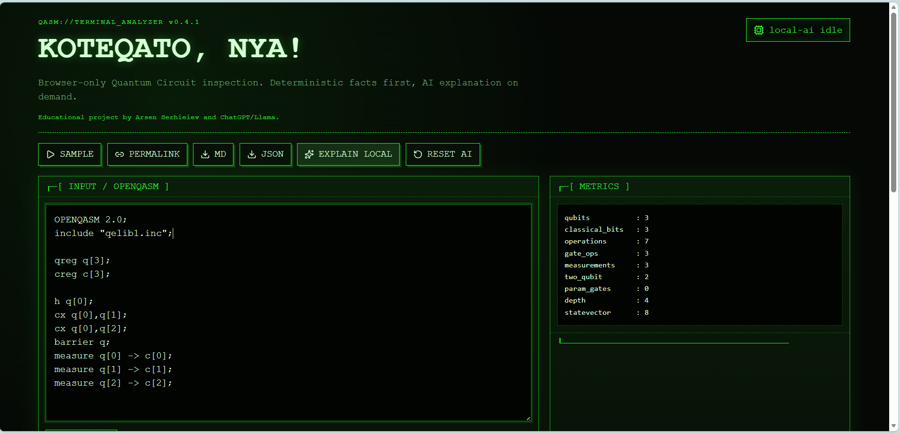

# KOTEQATO, NYA!

https://arsen-totem.github.io/koteqato/

Browser-only Quantum Circuit inspection. Deterministic facts first, AI explanation on demand.

**Authors:** Arsen Serhieiev and ChatGPT/Llama  
**Purpose:** educational project




## Scope

This MVP accepts OpenQASM text or `.qasm` files and performs deterministic static analysis entirely in the browser.

It does **not** execute Python or Qiskit code. For Qiskit circuits, export to QASM first.

## Features

- OpenQASM 2.0-oriented parser with partial OpenQASM 3 tolerance
- Qubit/classical-bit count
- Gate count and gate histogram
- Circuit depth approximation
- Two-qubit gate density warnings
- Mid-circuit measurement warnings
- Unused qubit detection
- Simple cancellation candidates: `H H`, `X X`, `Z Z`, `CX CX`, etc.
- Heuristic pattern detection: Bell seed, GHZ/star candidate, variational ansatz candidate
- ASCII circuit timeline
- Markdown export
- JSON export
- URL hash permalink using compressed QASM
- WebLLM local AI explanation on demand
- GitHub Pages workflow included

## Local AI model

Default model:

```txt
Llama-3.2-1B-Instruct-q4f16_1-MLC
```

The AI module uses `@mlc-ai/web-llm` and runs in the browser through WebGPU. The first run can take time because model assets are downloaded and cached by the browser. The deterministic analyzer remains usable even if WebGPU is unavailable.

The local AI receives only structured analyzer output, not raw QASM as the source of truth. This keeps exact facts such as gate count, depth, warnings, and optimization candidates controlled by deterministic code.

## Local development

```bash
npm install
npm run dev
```

## Build

```bash
npm run build
```

## Deploy to GitHub Pages

1. Push this project to GitHub.
2. Go to `Settings -> Pages`.
3. Set source to `GitHub Actions`.
4. Push to `main`.

The workflow sets `VITE_BASE_PATH` automatically to `/${repo-name}/`.

## Known limitations

- Static analyzer only; no statevector simulation.
- OpenQASM parser is intentionally minimal for MVP.
- Circuit depth is an approximation based on qubit occupancy layers.
- Pattern detection is heuristic, not proof of algorithm identity.
- No Python/Qiskit execution.
- WebLLM needs a WebGPU-capable browser for local AI.
